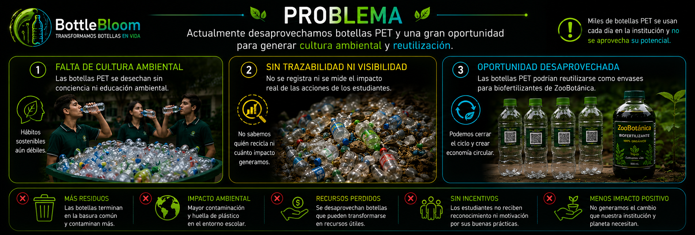

  

# BOTTLE BLOOM

## Transformamos botellas en vida

**Tema:** Sistema Inteligente de Cultura Ambiental para la Recolección, Validación, Reutilización y Transformación de Botellas PET en EcoBottles con Biofertilizantes mediante Inteligencia Artificial, Blockchain y Gamificación Educativa en Eight Academy.

---

## Equipo Bottle Bloom

| Imagen | Integrante | Rol |
| --- | --- | --- |
|  | Pamela Rubio | Líder |
|  | Emily Orozco | Secretaria |
|  | Thomas Hermida | Expositor |
|  | Emanuel Gerardo | Diseñador |
|  | Juan Diego Moreno | Investigador |

**Institución:** Unidad Educativa Eight Academy  
**Nivel:** Séptimo EGB  
**Mentora:** Lcda. Anita Parreño

---

## Problema

En las instituciones educativas se consumen diariamente bebidas en botellas plásticas PET que muchas veces son desechadas sin una adecuada clasificación, sin seguimiento ambiental y sin aprovechamiento posterior. Esto genera contaminación, dificulta el reciclaje y limita la formación de hábitos sostenibles dentro de la comunidad educativa.

Además, la falta de trazabilidad impide que los estudiantes visualicen el impacto real de sus acciones. Al mismo tiempo, ZooBotánica produce biofertilizantes que podrían distribuirse de forma más sostenible reutilizando botellas PET aptas como EcoBottles.

---

## Solución

Bottle Bloom propone una web app conectada a una estación inteligente que valida botellas PET con Inteligencia Artificial, indica el contenedor correcto, registra la participación del usuario, recompensa con Eight Coins, desbloquea NFTs educativos y mide el impacto ambiental acumulado.

Las botellas clasificadas como aptas se reutilizan como EcoBottles para contener biofertilizantes producidos en ZooBotánica. Cada EcoBottle puede recibir un código QR único con historial, impacto y trazabilidad digital.

---

## Cómo funciona

1. El usuario inicia sesión o crea su perfil Eco Guerrero.
2. Presenta una botella PET frente al módulo de escaneo.
3. La IA valida si el objeto es una botella PET y analiza su estado.
4. El sistema clasifica el resultado:
   - **Contenedor Verde:** botella apta para reutilización.
   - **Contenedor Amarillo:** botella PET que requiere limpieza.
   - **Contenedor Rojo:** botella no apta o dañada.
5. La acción se registra en el historial del usuario.
6. El usuario gana Eight Coins, XP y progreso en retos diarios.
7. Las botellas aptas se transforman en EcoBottles con biofertilizante.
8. La plataforma muestra impacto ambiental, NFTs, rachas y métricas acumuladas.

---

## ODS vinculados

Bottle Bloom contribuye directamente a los siguientes Objetivos de Desarrollo Sostenible:

| ODS | Vinculación |
| --- | --- |
| **ODS 4 - Educación de calidad** | Promueve aprendizaje práctico sobre reciclaje, sostenibilidad, tecnología y economía circular. |
| **ODS 11 - Ciudades y comunidades sostenibles** | Fortalece la gestión responsable de residuos dentro de la comunidad educativa. |
| **ODS 12 - Producción y consumo responsables** | Impulsa la reutilización de botellas PET y la reducción de residuos. |
| **ODS 13 - Acción por el clima** | Contribuye a disminuir el impacto ambiental asociado a la acumulación de plástico. |

---

## Tecnologías utilizadas

### MVP Web actual

- HTML5
- CSS3
- JavaScript
- LocalStorage para datos demo persistentes
- TensorFlow.js y COCO-SSD para validación visual inicial de botellas
- Cámara web con `getUserMedia`
- QR y pasaporte ecológico simulado
- GitHub Pages para publicación web

### Arquitectura proyectada

- Firebase Authentication
- Firebase Firestore
- Firebase Storage
- Flow Blockchain
- Modelos de visión artificial entrenados para botellas PET
- Dashboard ambiental en tiempo real
- Integración con estación física Bottle Bloom

---

## Funciones principales

- Registro e inicio de sesión de usuarios.
- Perfil Eco Guerrero editable.
- Escaneo de botellas con cámara o imagen subida.
- Validación de botella PET con IA.
- Clasificación por contenedores: verde, amarillo y rojo.
- Registro de botellas con ID único.
- Historial de entregas y detalle de clasificación.
- Eight Coins como sistema de recompensas.
- Retos diarios con progreso y rachas.
- NFTs educativos desbloqueables.
- Dashboard de impacto ecológico.
- Métricas ambientales: botellas recuperadas, CO2 evitado, agua ahorrada y árboles equivalentes.
- Simulación de trazabilidad con QR y blockchain.

---

## Impacto

Bottle Bloom transforma una acción cotidiana, desechar una botella, en una experiencia educativa, tecnológica y medible. El proyecto fortalece la cultura ambiental en Eight Academy y convierte a los estudiantes en protagonistas activos del cambio.

Indicadores medidos en la plataforma:

- Botellas PET recuperadas.
- EcoBottles generadas.
- CO2 evitado.
- Plantas beneficiadas.
- Biofertilizante producido.
- Eight Coins generadas.
- Retos completados.
- NFTs desbloqueados.

---

## Entregable 3

### MVP Web

[Abrir Plataforma BOTTLE BLOOM](https://alparrenob-ship-it.github.io/BOTTLE-BLOOM/)

### Video Demo

[Ver Video Demo BOTTLE BLOOM](https://www.youtube.com/shorts/YNOrElG3D5c?feature=share)

### Pitch Deck

Material de presentación del proyecto Bottle Bloom.

### Whitepaper

[Leer Whitepaper BOTTLE BLOOM V.2.1](https://github.com/alparrenob-ship-it/BOTTLE-BLOOM/blob/main/WHITEPAPER%20BOTTLE%20BLOOM%20V.2.1.pdf)

### Infografía

Material visual de síntesis del problema, solución, flujo y beneficios de Bottle Bloom.

---

## Créditos

Proyecto desarrollado para Eight Academy, campus ZooBotánica, como propuesta de innovación ambiental, educación sostenible y tecnología aplicada al reciclaje PET.
